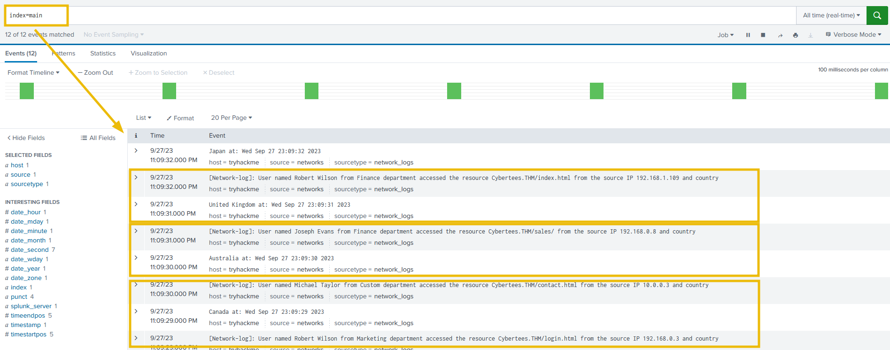

# TryHackMe- Fixit


# TryHackMe - Fixit Writeup
# Background
In this challenge room, you will act as John, who has recently cleared his third screening interview for the SOC-L2 position at MSSP Cybertees Ltd, and a final challenge is ready to test your knowledge, where you will be required to apply the knowledge to FIX the problems in Splunk.
You are presented with a Splunk Instance and the network logs being ingested from an unknown device.
# Challenge: FIXIT
This challenge is divided into three levels:
### Level 1: Fix Event Boundaries
Fix the Event Boundaries in Splunk. As the image below shows, Splunk cannot determine the Event boundaries, as the events are coming from an unknown device.

### Level 2: Extract Custom Fields
Once the event boundaries are defined, it is time to extract the custom fields to make the events searchable.
- Username
- Country
- Source_IP
- Department
- Domain
Sample Logs:
To create regex patterns, sample Network logs are shown below:
```c
[Network-log]: User named Johny Bil from Development department accessed the resource Cybertees.THM/about.html from the source IP 192.168.0.1 and country
Japan at: Thu Sep 28 00:13:46 2023
[Network-log]: User named Johny Bil from Marketing department accessed the resource Cybertees.THM/about.html from the source IP 192.168.2.2 and country
Japan at: Thu Sep 28 00:13:46 2023
[Network-log]: User named Johny Bil from HR department accessed the resource Cybertees.THM/about.html from the source IP 10.0.0.3 and country
Japan at: Thu Sep 28 00:13:46 2023
```
Level 3: Perform Analysis on the FIXED Events
Once the custom fields are parsed, we can use those fields to analyze the Event logs. Examine the events and answer the questions.
Happy Fixing!


# Fixing Event Boundaries
From above, the event boundaries are not being parsed correctly and causing line breaks at abnormal locations in the logs. This is due to a missing or misconfiguration in the props.conf file.
Looking into the default directory within the fixit app, I noticed that there isn’t a props.conf defined which is the cause of the weird line breaks. 

This can be fixed by creating the file and adding the below configurations to the sourcetype which is defined in the inputs.conf for the network logs.

```javascript
[network_logs]
SHOULD_LINEMERGE = true
BREAK_ONLY_BEFORE = \[Network-log\]
```
After restarting splunk we can see that the logs are being parsed correctly with linebreaks at each new log.


# Extracting Custom Fields
To extract the custom fields I used regex101.com to test out the regex needed to extract the fields and then added that to the respective conf files below.
- Username
- Country
- Source_IP
- Department
- Domain
Regex I came up with to extract the fields is as such. I don’t claim to be good at regex but it worked. I’m sure there are better ways for performance to extract these fields.

```javascript
named\s(\w+\s.\w+)\sfrom\s(\w+).+resource\s(\w+\.\w+).+IP\s(\d{1,3}\.\d{1,3}\.\d{1,3}\.\d{1,3}).+country\s\n(\w.+)\sat
```
transforms.conf

fields.conf


props.conf


After restarting the splunk server and running the search again I can see the fields are being broken out as expected within each event.


### What is the full path of the FIXIT app directory?
This app can be found in /opt/splunk/etc/apps/
### What Stanza will we use to define Event Boundary in this multi-line Event case?
[Network-log] starts every event so we can use the BREAK_ONLY_BEFORE 
### In the inputs.conf, what is the full path of the network-logs script?
This can be found by looking inside of /opt/splunk/etc/apps/fixit/default/inputs.conf

### What regex pattern will help us define the Event's start?
\[Network-log\]
### What is the captured domain?

### How many countries are captured in the logs?
```javascript
index=main
|stats count by Country
```
### How many departments are captured in the logs?
```javascript
index=main
|stats count by Department
```
### How many usernames are captured in the logs?
```javascript
index=main
|stats count by Username
```
### How many source IPs are captured in the logs?
```javascript
index=main
|stats count by Source_IP
```
### Which configuration files were used to fix our problem? [Alphabetic order: File1, file2, file3]
Files can be found in /opt/splunk/etc/apps/fixit/default/
### What are the TOP two countries the user Robert tried to access the domain from? [Answer in comma-separated and in Alphabetic Order][Format: Country1, Country2]
```javascript
index=main Username=Robert*
|stats count by Country
|sort - count
```
### Which user accessed the secret-document.pdf on the website?
```javascript
index=main secret-document.pdf
|stats count by Username
```


