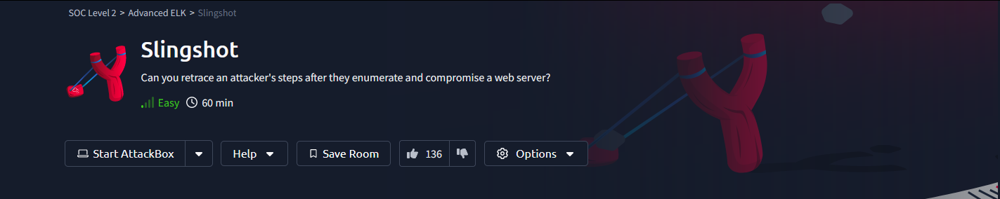

# TryHackMe-Slingshot

# TryHackMe - Slingshot Writeup
# Background
Slingway Inc., a leading toy company, has recently noticed suspicious activity on its e-commerce web server and potential modifications to its database. To investigate the suspicious activity, they've hired you as a SOC Analyst to look into the web server logs and uncover any instances of malicious activity.
To aid in your investigation, you've received an Elastic Stack instance containing logs from the suspected attack. Below, you'll find credentials to access the Kibana dashboard. Slingway's IT staff 
mentioned that the suspicious activity started on July 26, 2023.
By investigating and answering the questions below, we can create a timeline of events to lead the incident response activity. This will also allow us to present concise and confident findings that answer questions such as:
- What vulnerabilities did the attacker exploit on the web server?
- What user accounts were compromised?
- What data was exfiltrated from the server?

# Investigation

# Questions
What was the attacker's IP?

What was the first scanner that the attacker ran against the web server?

What was the User Agent of the directory enumeration tool that the attacker used on the web server?

In total, how many requested resources on the web server did the attacker fail to find?

What is the flag under the interesting directory the attacker found?

What login page did the attacker discover using the directory enumeration tool?

What was the user agent of the brute-force tool that the attacker used on the admin panel?

What username:password combination did the attacker use to gain access to the admin page?

What flag was included in the file that the attacker uploaded from the admin directory?

What was the first command the attacker ran on the web shell?

What file location on the web server did the attacker extract database credentials from using Local File Inclusion?

What directory did the attacker use to access the database manager?

What was the name of the database that the attacker exported?

What flag does the attacker insert into the database?
