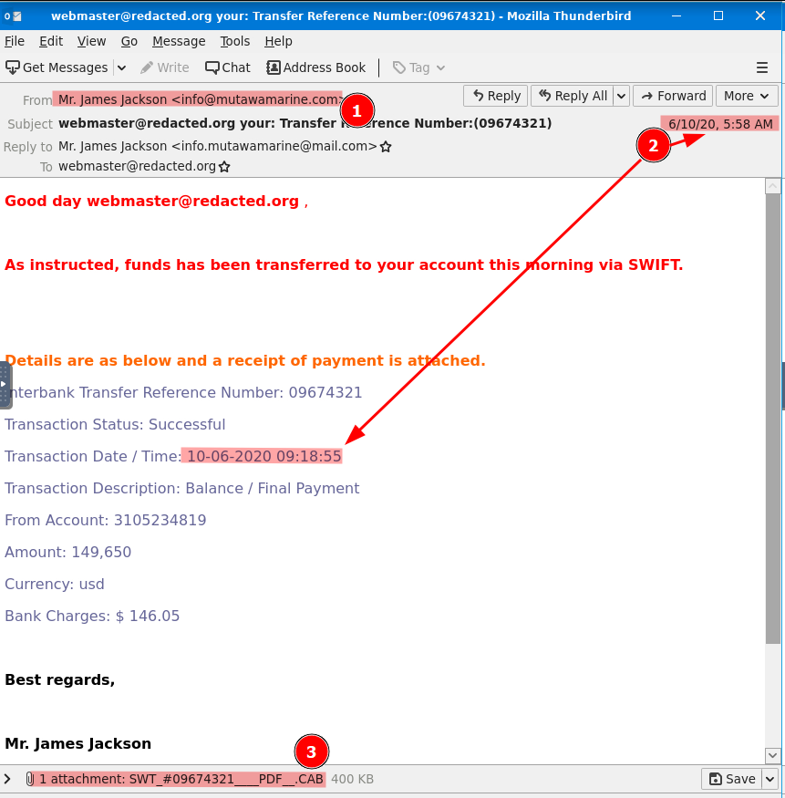
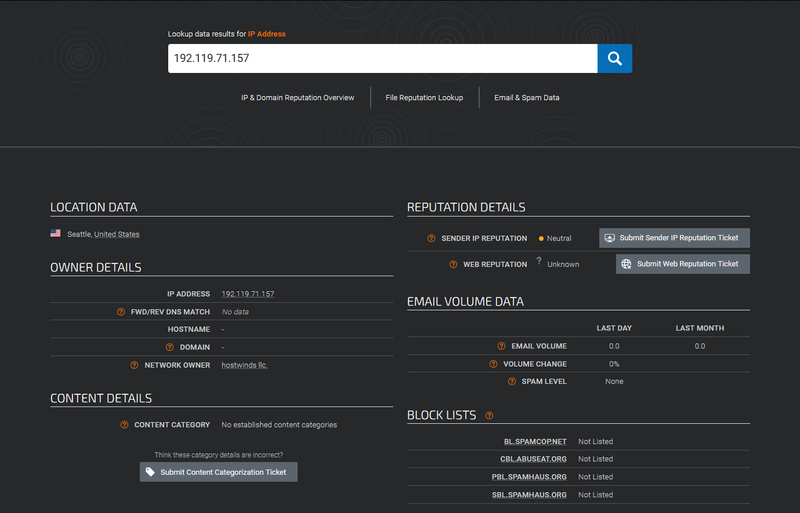
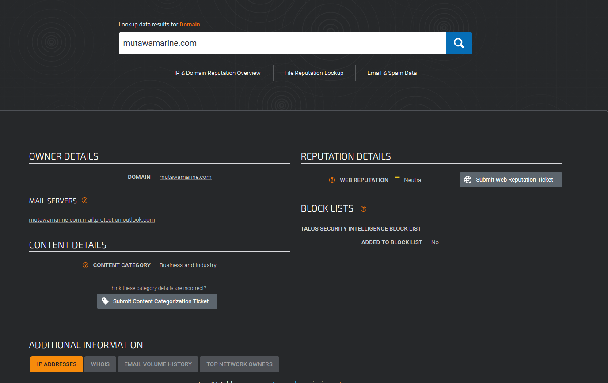
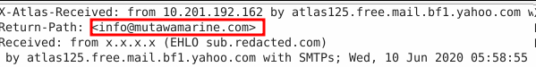
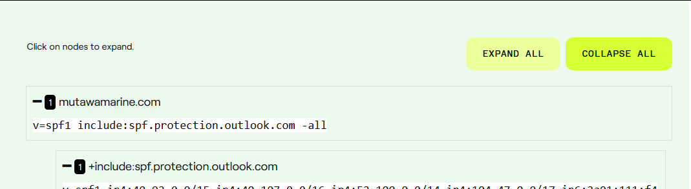
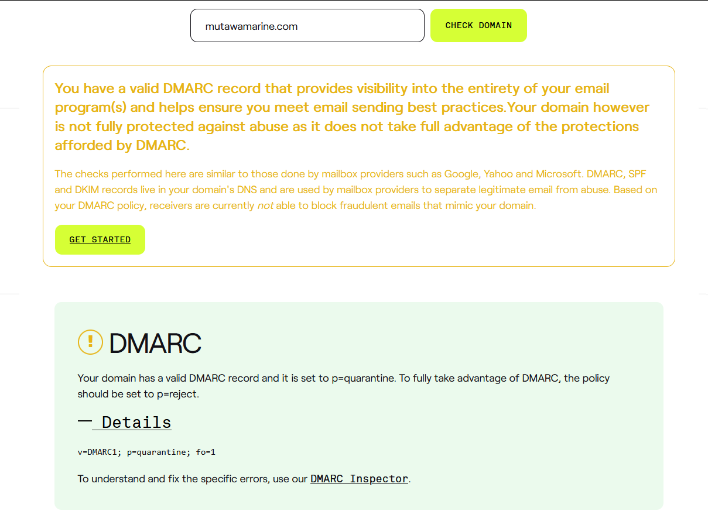
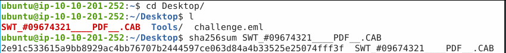
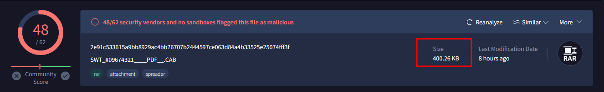

# TryHackMe-The Greenholt Phish Writeup

# TryHackMe - The Greenholt Phish Writeup
# Background
A Sales Executive at Greenholt PLC received an email that he didn't expect to receive from a customer. He claims that the customer never uses generic greetings such as "Good day" and didn't expect any amount of money to be transferred to his account. The email also contains an attachment that he never requested. He forwarded the email to the SOC (Security Operations Center) department for further investigation.
Investigate the email sample to determine if it is legitimate.

# Email Analysis
After opening the email into Thunderbird to view there were a few things that jumped out as suspicious including the email not matching the sender name.

1. Sender name (Mr. James Jackson) does not line up to the email it was sent from (info@mutawamarine[.]com)
1. The transaction status shows successful which means it has been completed, but comparing dates the Transaction Date/Time is later than the time of the email being received.
  1. Received: 6-10-20 05:58
  1. Transaction Time: 6-10-20 09:18
1. The file attached is made to look like a PDF but has the extension of .cab which upon further investigation is a Cabinet file similar to an archive file.
  1. https://en.wikipedia.org/wiki/Cabinet_(file_format)

Notes from viewing email file in mouspad:
IP addresses:
  - 10[.]197[.]41[.]148 - mta4212[.]mail[.]bf1[.]yahoo[.]com email server
  - 192[.]119[.]71[.]157 - sender ip
  
Suspicious Domains:
  - mutawamarine[.]com
  
Email addresses:
  - Reply-To: info[.]mutawamarine@mail[.]com
  - From: info@mutawamarine[.]com
  - To: webmaster@redacted[.]org
  - X-Apparently-To: redacted@yahoo[.]com
Suspicious Filename:
  - SWT_#09674321____PDF__.CAB
SPF Record:
  - Received-SPF: fail (domain of mutawamarine[.]com does not designate x.x.x.x as permitted sender)
  - Authentication-Results: atlas125[.]free[.]mail[.]bf1[.]yahoo[.]com;
spf=fail smtp[.]mailfrom=mutawamarine[.]com;
dmarc=unknown
### 
What is the Transfer Reference Number listed in the email's Subject?
answer: 09674321

### Who is the email from?
answer: Mr. James Jackson

### What is the SPF record for the Return-Path domain?

Here I used SPF Surveyor to grab the SPF record of the domain.

answer: in screenshot

### What is the DMARC record for the Return-Path domain?
Again I used dmarcian’s tool for DMARC Domain Checker to get the DMARC record.

answer: in screenshot

### What is the name of the attachment?
answer: SWT_#09674321____PDF__.CAB

### What is the SHA256 hash of the file attachment?
To get the SHA256, I saved the file from the email and ran sha256sum on the file to grab the hash.

answer: in screenshot

### What is the attachments file size? (Don't forget to add "KB" to your answer, NUM KB)
I was having some trouble getting the right file size it wanted so I had to use the hint here. I then used VirusTotal to search the SHA256 and obtain the correct file size.
link to analysis: https://www.virustotal.com/gui/file/2e91c533615a9bb8929ac4bb76707b2444597ce063d84a4b33525e25074fff3f

answer: in screenshot

### What is the actual file extension of the attachment?
This also came from VirusTotal based on past analysis.
link to analysis: https://www.virustotal.com/gui/file/2e91c533615a9bb8929ac4bb76707b2444597ce063d84a4b33525e25074fff3f

answer: RAR

